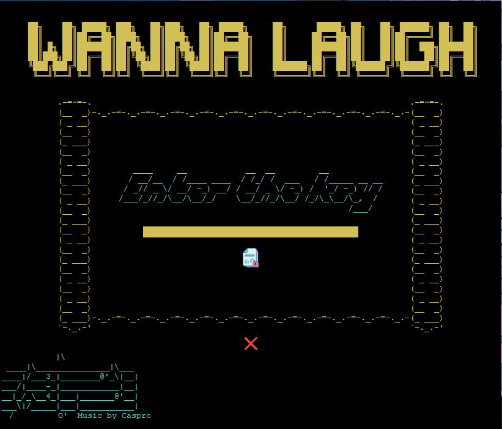

## WannaLaugh
 A ransomware written in python for Windows.

 

### Disclaimer
 Use this tool at your own risk. Author(s) is/are not responsible or liable if you damage your own computer or anyone else's. Follow all local, state,  federal, and international laws as it pertains to your geographic location. Do NOT use this tool maliciously as it is intended for educational purpose only.

### **How to use this**

- Get the binary(exe) from [here](https://github.com/sakshatshinde/WannaLaugh/releases)
- Make a file called "key.txt"
- Enter an arbitrary "key" or any gibbrish really into the newly created file
- Make a directory in your __C:\Users\[localUser]__ called ***nukeMe***
- Check if the path looks like this : __C:\Users\[localUser]\nukeMe__
- Make or copy some random files in there for testing purposes
---

### **How to use this via Python CLI** 

- Install python 3.X (If you already have it skip this step)
- Make a directory in your __C:\Users\[localUser]__ called ***nukeMe***
- Check if the path looks like this : __C:\Users\[localUser]\nukeMe__
- Make or copy some random files in there for testing purposes
---
**Now we will move to the installation of the script**
- Download or clone this project
- Extract the project in you desired location
- Next install pip from [**here**](https://pip.pypa.io/en/stable/installing/)
- Open your python console
- cd to the downloaded project (Change directory)
- Type this `pip install -r requirements.txt`
- Let the installation be complete
- Run **main.py**

## Result
The files in the **nukeMe** folder would be encrypted. Then a window will pop up which you can't close easily.
Copy the key from the key.txt file in the root folder of the project and then click the first button. **Nothing will happen**.
Now click the second button right below the first button. This will exit the window. 
Check the files in the folder **nukeMe** they have been restored
